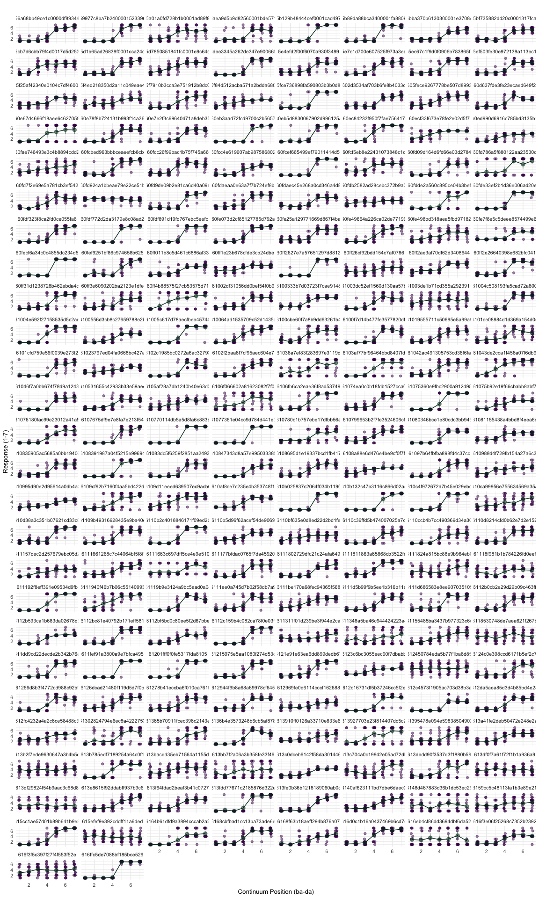
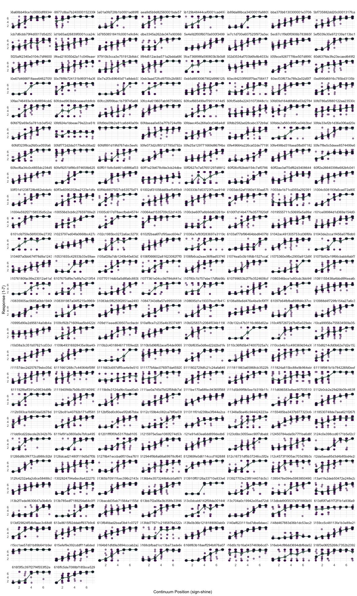
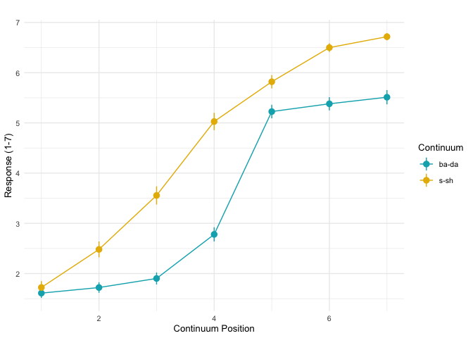

# Project summary

In this experiment, we wanted to measure individual differences in how categorically listeners perceive different speech sounds. For many years, we thought that listeners perceived speech sounds in discrete categories (e.g., /b/ or /d/), despite variability in how each individual sounds are realized. We now know, however, that listeners can perceive subtle differences in sounds, for example, when a sound falls between the sounds /b/ and /d/. 

We asked participants to listen to tokens from two continua of synthetically created speech stimuli. One continuum consisted of seven equal steps between the speech syllables ba to da (starting with ba and each token becoming more da-like), and the other consisted of seven equal steps between the two words sign to shine (starting with sign and each token becoming more sh-like). Participants heard each token on each continuum 15 times, for a total of 105 trials per continuum. Participants were asked to rate on a scale from 1-7 how ba-like or da-like (or s-like or sh-like) the tokens sounded to them. 

We analyzed the data with a non-linear mixed effects four-parameter logistic model and extracted the slope coefficients as a measure of how categorically listeners perceived the sounds (higher (steeper) slope value = more categorical/less graded). We additionally tested whether ba-da was perceived more categorically than s-sh, as this is often assumed but rarely reported. 

# Data wrangling


```r
# load packages
library(tidyverse)
library(nlme)
library(ggthemes)
library(data.table)
library(kableExtra)

theme_set(theme_minimal(base_size = 10))
```


```r
# read in files
path <- "./data/" # set path
file_names <- dir(path = path, pattern = "*.csv") #where you have your files

# write a function to read in files; something was weird with the reaction time column, so I drop it here
read <- function(x){
  f <- file.path(path, x)
  fread(f, 
        header = TRUE, 
        drop = "Reaction Time", 
        sep = ","
        )
}

# apply function to the list of file names and bind rows to form a data frame
data <- lapply(file_names, read) %>% bind_rows()

# check to make sure participants passed the headphone check
# subset data frame to necessary columns
data_checks <- data %>%
  select(c("Participant Public ID", "checkpoint-irp3", "randomiser-912i")) %>%
  distinct()

# change NAs to blank
data_checks[is.na(data_checks)] <- ""

# create a column for passing or failing the headphone check and add a column for checking for order effects (not needed here)
data_checks <- data_checks %>%
  mutate(headphone_check = ifelse(`checkpoint-irp3` == "Fail", "Fail", "Pass")) %>%
  mutate(first_task = case_when(`randomiser-912i` == "order_1" | `randomiser-912i` == "order_2" ~ "nn_first",
                                `randomiser-912i` == "order_3" | `randomiser-912i` == "order_4" ~ "nat_first")) %>%
  select(!c(`checkpoint-irp3`, `randomiser-912i`))

# rename first column
colnames(data_checks)[1] <- "Subject"

# We excluded participants from the analyses who did not use headphones for the task
# and who reported being proficient in a language that has one of the sounds we
# wanted them to discriminate

# vector/data frame of participants to eliminate from analyses
eliminate <- unique(data_checks$Subject[data_checks$headphone_check == "Fail"])
eliminate2 <- read.csv("eliminate.csv")

# filter out those participants
data2 <- data %>%
  filter(!`Participant Public ID` %in% eliminate) %>%
  filter(!`Participant Public ID` %in% eliminate2$Subject)

# count eliminated participants
total_eliminated_participants <- length(unique(data$`Participant Public ID`)) - length(unique(data2$`Participant Public ID`))

# change this column name
colnames(data2)[40] <- "Zone_Type"

# filter to data for ba-da continuum
bada <- data2 %>%
  filter(Zone_Type == "response_rating_scale_likert" & `Task Name` == "VAS /ba-da/") %>%
  select("Participant Public ID", "cont_step", "Response")

# rename columns
colnames(bada) <- c("Subject", "ContinuumPoint", "SliderResponse")

# convert columns with responses to numeric and subject column to factor
bada <- bada %>%
  mutate_at(c("SliderResponse", "ContinuumPoint"), as.numeric) %>%
  mutate_at("Subject", as.factor)

# filter to data for s-sh continuum
signshine <- data2 %>%
  filter(Zone_Type == "response_rating_scale_likert" & `Task Name` == "VAS shine-sign") %>%
  select("Participant Public ID", "cont_step", "Response")

# rename columns
colnames(signshine) <- c("Subject", "ContinuumPoint", "SliderResponse")

# convert columns with responses to numeric and subject column to factor
signshine <- signshine %>%
  mutate_at(c("SliderResponse", "ContinuumPoint"), as.numeric) %>%
  mutate_at("Subject", as.factor)
```

# ba-da data

## Plot individual data

Here we plot each participant's raw data and the mean of their responses for each point on the continuum. As we see from the plots, there is a lot of individual variability, so we will quantify this variability with a 4-parameter logistic model below.


```r
# make a data frame with summary statistics per participant and per continuum point for plotting
stats <- Rmisc::summarySE(data = bada, measurevar="SliderResponse",
                          groupvars=c("Subject", "ContinuumPoint"))

# make a template for plot components
jitter <- geom_jitter(width = .1, height = 0, alpha = .5, color = "#440154")

# create function to plot the mean responses of each continuum point with errorbars representing the 95% confidence intervals and connect each point with a line
geom_pointline <- function(df) {
  list(
    geom_pointrange(data = df, aes(ymax=SliderResponse+ci, ymin=SliderResponse-ci),
                    color = "#013220", fill = df$SliderResponse, alpha = .5),
    geom_line(data = df, aes(group=1), color = "#013220")
  )
}

# take main data frame (with individual data points) and plot all data points
# facet by participant so we see each participant's plot individually
bada %>% 
  ggplot(aes(x = ContinuumPoint, y = SliderResponse)) +
  facet_wrap(~Subject, ncol = 8) +
  jitter +
  geom_pointline(stats) +
  labs(title = "", x = "Continuum Position (ba-da)", y = "Response (1-7)")
```

<!-- -->

## Four parameter logistic model: ba-da data

This code fits a four parameter logistic model: it fits the data to an S-curve and estimates the upper and lower asymptotes (max and min, respectively), the inflection point (the point where participants start perceiving speech sounds on the continuum as a different sound, xmid), and the slope (how steep the slope is at the inflection point, or in this case, how categorically participants perceive the sounds, slope).

First we want to get some reasonable starting values. For min, max, and xmid, we can guess, but the slope is more difficult. We fit a 4pl model with a self starting function (SSfpl), and we get the slope from that and take the reciprocal (because we flipped the direction of the slope to be ascending).

Trying out different starting values can sometimes help with convergence issues.


```r
# get starting values
(init_bada <- stats::getInitial(SliderResponse ~ SSfpl(ContinuumPoint, min, max, xmid, slope), data = bada))
```

```
##       min       max      xmid     slope 
## 1.7257827 5.4626811 4.2618558 0.2871218
```

```r
# make a list with the start values from the model above
start_values <- c(min = 1, 
                     max = 7,
                     xmid = 4,
                     slope = 1/init_bada[["slope"]]) # we switched the direction of the function, so we take the reciprocal of the slope

model_4pl_bada <- nlme(SliderResponse ~ max - (max-min)/(1+exp(slope*(ContinuumPoint-xmid))),
                data = bada,
                control = list(maxIter = 10000),
                fixed = min + max + xmid + slope ~ 1, # here you can add fixed effects 
                random = list(Subject = pdDiag(min + max + xmid + slope ~ 1)),
                start = start_values)

# take a look at the estimates to make sure they look reasonable
bada_results <- data.frame(summary(model_4pl_bada)$tTab)

kbl(bada_results,
    digits = 2) %>%
  kable_styling()
```

<table class="table" style="margin-left: auto; margin-right: auto;">
 <thead>
  <tr>
   <th style="text-align:left;">   </th>
   <th style="text-align:right;"> Value </th>
   <th style="text-align:right;"> Std.Error </th>
   <th style="text-align:right;"> DF </th>
   <th style="text-align:right;"> t.value </th>
   <th style="text-align:right;"> p.value </th>
  </tr>
 </thead>
<tbody>
  <tr>
   <td style="text-align:left;"> min </td>
   <td style="text-align:right;"> 1.62 </td>
   <td style="text-align:right;"> 0.05 </td>
   <td style="text-align:right;"> 21005 </td>
   <td style="text-align:right;"> 31.01 </td>
   <td style="text-align:right;"> 0 </td>
  </tr>
  <tr>
   <td style="text-align:left;"> max </td>
   <td style="text-align:right;"> 5.56 </td>
   <td style="text-align:right;"> 0.07 </td>
   <td style="text-align:right;"> 21005 </td>
   <td style="text-align:right;"> 81.58 </td>
   <td style="text-align:right;"> 0 </td>
  </tr>
  <tr>
   <td style="text-align:left;"> xmid </td>
   <td style="text-align:right;"> 4.23 </td>
   <td style="text-align:right;"> 0.03 </td>
   <td style="text-align:right;"> 21005 </td>
   <td style="text-align:right;"> 148.62 </td>
   <td style="text-align:right;"> 0 </td>
  </tr>
  <tr>
   <td style="text-align:left;"> slope </td>
   <td style="text-align:right;"> 3.54 </td>
   <td style="text-align:right;"> 0.18 </td>
   <td style="text-align:right;"> 21005 </td>
   <td style="text-align:right;"> 19.90 </td>
   <td style="text-align:right;"> 0 </td>
  </tr>
</tbody>
</table>


# s-sh data

## Plot s-sh data

Here we plot each participant's raw data and the mean of their responses for each point on the continuum. As we see from the plots, there is a lot of individual variability, so we will quantify this variability with a 4-parameter logistic model below.


```r
# make a data frame with summary statistics per participant and per continuum point for plotting
stats_2 <- Rmisc::summarySE(data = signshine, measurevar="SliderResponse",
                          groupvars=c("Subject", "ContinuumPoint"))

# take main data frame (with individual data points) and plot all data points
# facet by participant so we see each participant's plot individually
signshine %>% 
  ggplot(aes(x = ContinuumPoint, y = SliderResponse)) +
  facet_wrap(~Subject, ncol = 8) +
  jitter +
  geom_pointline(stats_2) +
  labs(title = "", x = "Continuum Position (sign-shine)", y = "Response (1-7)")
```

<!-- -->


## Four parameter logistic model: s-sh data


```r
# get starting values
(init_ssh <- stats::getInitial(SliderResponse ~ SSfpl(ContinuumPoint, min, max, xmid, slope), data = signshine))
```

```
##      min      max     xmid    slope 
## 1.103542 6.895605 3.283349 1.079675
```

```r
# make a list with the start values from the model above
start_values_2 <- c(min = 1, 
                     max = 7,
                     xmid = 3.5,
                     slope = 1/init_ssh[["slope"]]) # we switched the direction of the function, so we take the reciprocal of the slope

model_4pl_ssh <- nlme(SliderResponse ~ max - (max-min)/(1+exp(slope*(ContinuumPoint-xmid))),
                data = signshine,
                control = list(maxIter = 10000),
                fixed = min + max + xmid + slope ~ 1, # here you can add fixed effects 
                random = list(Subject = pdDiag(min + max + xmid + slope ~ 1)),
                start = start_values_2)

# take a look at the estimates to make sure they look reasonable
ssh_results <- data.frame(summary(model_4pl_ssh)$tTab)

kbl(ssh_results,
    digits = 2) %>%
  kable_styling()
```

<table class="table" style="margin-left: auto; margin-right: auto;">
 <thead>
  <tr>
   <th style="text-align:left;">   </th>
   <th style="text-align:right;"> Value </th>
   <th style="text-align:right;"> Std.Error </th>
   <th style="text-align:right;"> DF </th>
   <th style="text-align:right;"> t.value </th>
   <th style="text-align:right;"> p.value </th>
  </tr>
 </thead>
<tbody>
  <tr>
   <td style="text-align:left;"> min </td>
   <td style="text-align:right;"> 0.98 </td>
   <td style="text-align:right;"> 0.04 </td>
   <td style="text-align:right;"> 21005 </td>
   <td style="text-align:right;"> 27.74 </td>
   <td style="text-align:right;"> 0 </td>
  </tr>
  <tr>
   <td style="text-align:left;"> max </td>
   <td style="text-align:right;"> 6.96 </td>
   <td style="text-align:right;"> 0.02 </td>
   <td style="text-align:right;"> 21005 </td>
   <td style="text-align:right;"> 321.59 </td>
   <td style="text-align:right;"> 0 </td>
  </tr>
  <tr>
   <td style="text-align:left;"> xmid </td>
   <td style="text-align:right;"> 3.25 </td>
   <td style="text-align:right;"> 0.07 </td>
   <td style="text-align:right;"> 21005 </td>
   <td style="text-align:right;"> 44.18 </td>
   <td style="text-align:right;"> 0 </td>
  </tr>
  <tr>
   <td style="text-align:left;"> slope </td>
   <td style="text-align:right;"> 1.16 </td>
   <td style="text-align:right;"> 0.04 </td>
   <td style="text-align:right;"> 21005 </td>
   <td style="text-align:right;"> 29.21 </td>
   <td style="text-align:right;"> 0 </td>
  </tr>
</tbody>
</table>


# All data

## Plot combined data from both continua


```r
bada <- bada %>%
  mutate(continuum = "bada")

signshine <- signshine %>%
  mutate(continuum = "ssh")

data_all <- bind_rows(bada, signshine)

data_all_plot_prep <- data_all %>%
  group_by(Subject, ContinuumPoint, continuum) %>%
  summarize(SliderResponse = mean(SliderResponse))
  
data_all_plot <- Rmisc::summarySE(data = data_all_plot_prep, measurevar="SliderResponse",
                          groupvars=c("ContinuumPoint", "continuum"))

data_all_plot %>% 
  ggplot(aes(x = ContinuumPoint, y = SliderResponse, color = continuum)) +
  # facet_wrap(~continuum) +
  geom_pointrange(aes(ymax = SliderResponse+ci, ymin = SliderResponse-ci)) +
  geom_line(aes(group = continuum)) +
  scale_color_manual(values = c("#00AFBB", "#E7B800"), labels = c("ba-da", "s-sh")) +
  labs(title = "", x = "Continuum Position", y = "Response (1-7)", color = "Continuum")
```

<!-- -->


## Four parameter logistic model: test difference in slopes between the two continua

The slope certainly looks steeper in the ba-da continuum compared to the s-sh continuum; however, we will test this statistically. To do this, we add a fixed effect of continuum to test whether slopes are steeper in the stop continuum (ba-da) than the fricative continuum (s-sh).


```r
# convert continuum to factor
data_all$continuum <- as.factor(data_all$continuum)

# define contrasts: deviation coding with ba-da as .5, s-sh as -.5
contrasts(data_all$continuum) <- c(.5, -.5)
contrasts(data_all$continuum)
```

```
##      [,1]
## bada  0.5
## ssh  -0.5
```

```r
# get starting values
(init_all <- stats::getInitial(SliderResponse ~ SSfpl(ContinuumPoint, min, max, xmid, slope), data = data_all))
```

```
##       min       max      xmid     slope 
## 1.7047823 6.2162123 3.9423463 0.7208281
```

```r
# now we have to have an extra start value because we now have an intercept and a slope for the effect of continuum on the slope
# we use the start values for all the data from the model above and add a value for the slope of continuum
start_values_3 <- c(1,7,4,1,0.5)

# added a fixed effect of continuum for slope
model_4pl_all <- nlme(SliderResponse ~ max - (max-min)/(1+exp(slope*(ContinuumPoint-xmid))),
                data = data_all,
                control = list(maxIter = 10000),
                fixed = list(min ~ 1, max ~ 1, xmid ~ 1, slope ~ continuum),
                random = list(Subject = pdDiag(list(min + max + xmid ~ 1, slope ~ continuum))),
                start = start_values_3)


# take a look at the estimates to make sure they look reasonable
all_results <- data.frame(summary(model_4pl_all)$tTab)

kbl(all_results,
    digits = 2) %>%
  kable_styling()
```

<table class="table" style="margin-left: auto; margin-right: auto;">
 <thead>
  <tr>
   <th style="text-align:left;">   </th>
   <th style="text-align:right;"> Value </th>
   <th style="text-align:right;"> Std.Error </th>
   <th style="text-align:right;"> DF </th>
   <th style="text-align:right;"> t.value </th>
   <th style="text-align:right;"> p.value </th>
  </tr>
 </thead>
<tbody>
  <tr>
   <td style="text-align:left;"> min </td>
   <td style="text-align:right;"> 0.21 </td>
   <td style="text-align:right;"> 0.17 </td>
   <td style="text-align:right;"> 42214 </td>
   <td style="text-align:right;"> 1.25 </td>
   <td style="text-align:right;"> 0.21 </td>
  </tr>
  <tr>
   <td style="text-align:left;"> max </td>
   <td style="text-align:right;"> 7.28 </td>
   <td style="text-align:right;"> 0.14 </td>
   <td style="text-align:right;"> 42214 </td>
   <td style="text-align:right;"> 52.48 </td>
   <td style="text-align:right;"> 0.00 </td>
  </tr>
  <tr>
   <td style="text-align:left;"> xmid </td>
   <td style="text-align:right;"> 3.70 </td>
   <td style="text-align:right;"> 0.11 </td>
   <td style="text-align:right;"> 42214 </td>
   <td style="text-align:right;"> 34.08 </td>
   <td style="text-align:right;"> 0.00 </td>
  </tr>
  <tr>
   <td style="text-align:left;"> slope.(Intercept) </td>
   <td style="text-align:right;"> 1.42 </td>
   <td style="text-align:right;"> 0.07 </td>
   <td style="text-align:right;"> 42214 </td>
   <td style="text-align:right;"> 19.91 </td>
   <td style="text-align:right;"> 0.00 </td>
  </tr>
  <tr>
   <td style="text-align:left;"> slope.continuum1 </td>
   <td style="text-align:right;"> 0.69 </td>
   <td style="text-align:right;"> 0.13 </td>
   <td style="text-align:right;"> 42214 </td>
   <td style="text-align:right;"> 5.45 </td>
   <td style="text-align:right;"> 0.00 </td>
  </tr>
</tbody>
</table>

## Results and discussion

The significant effect of slope.continuum1 suggests that there is a significant difference between the slopes in the two continua. The estimate represents the difference in slopes between the two continua, and it is positive. Since we coded our contrasts as ba-da = 0.5 and s-sh = -0.5, that means that participants' ba-da slope is significantly steeper than their s-sh slope (mean ba-da slope = $1.42 + (0.69*0.5) = 1.765$; mean s-sh slope = $1.42 + (0.69*-0.5) = 1.075$).

